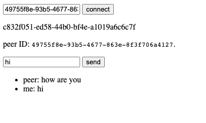

# Basic PeerJS / WebRTC chat

**Technology**: [PeerJS](https://peerjs.com/), [WebRTC](https://webrtc.org/)

**Usage**: Open the [`chat.html`](chat.html) file on two devices (or in two tabs). There's no need to start a local server, you can open it by double-clicking, just like any other HTML file. Connect to the other device by their ID - it's the long string displayed on the page. After the connection is established, you can message the other device (and vice versa).

**Notes**: This example uses [UmbrellaJS](https://umbrellajs.com/) to be more readable and concise.
