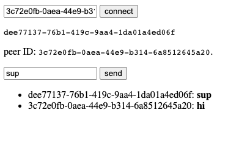

# Y.js over PeerJS

**Technology**: [Y.js](https://yjs.dev/), [PeerJS](https://peerjs.com/) 

**Usage**: Open the [`index.html`](index.html) file on two devices (or in two tabs). There's no need to start a local server, you can open it by double-clicking, just like any other HTML file. Connect to the other device by their ID - it's the long string displayed on the page. After the connection is established, you can message the other device (and vice versa).

**Notes**: Read more in [Y.js's docs](https://docs.yjs.dev/), especially in section [*Document Updates*](https://docs.yjs.dev/api/document-updates). I implemented the simplest option - exchanging complete document structures.

This example uses [UmbrellaJS](https://umbrellajs.com/) to be more readable and concise.
